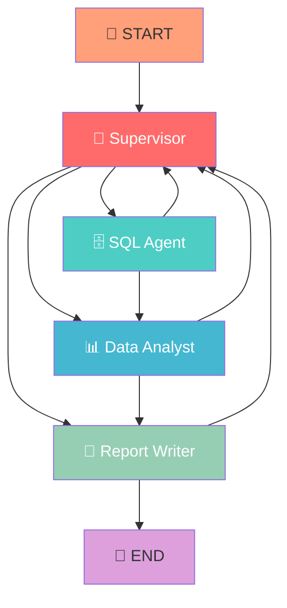

# 🤖 Multi-Agent Network Log Analyzer

> **Inteligentny system analizy logów sieciowych** oparty na LangGraph i wieloagentowej architekturze AI

[](https://www.python.org/downloads/)
[](https://github.com/langchain-ai/langgraph)
[](https://streamlit.io/)
[](https://opensource.org/licenses/MIT)

## 🎯 Co to jest?

System **Multi-Agent Network Log Analyzer** to zaawansowane narzędzie do analizy logów sieciowych, które wykorzystuje **4 wyspecjalizowanych agentów AI** do automatycznego przetwarzania, analizy i raportowania danych o aktywności sieciowej.

### ✨ Kluczowe funkcje

- 🧠 **Inteligentna orchestracja** - LangGraph zarządza przepływem między agentami
- 📊 **Automatyczna analiza** - wykrywanie wzorców, trendów i anomalii  
- 📝 **Profesjonalne raporty** - strukturyzowane wnioski i rekomendacje
- 🎨 **Intuitive UI** - nowoczesny interfejs Streamlit
- ⚡ **Skalowalność** - obsługa dużych zbiorów logów
- 🔄 **Samo-naprawiający się** - obsługa błędów i recovery

## 🏗️ Architektura systemu



### 🤖 Agenci w systemie

| Agent | Rola | Odpowiedzialność | Kluczowe API |
|-------|------|------------------|--------------|
| **👔 Supervisor** | Orchestrator | Zarządzanie przepływem, routing decyzji | `current_agent`, `next_agent` |
| **🗄️ SQL Agent** | Data Layer | Wykonywanie zapytań SQL, pobieranie danych | `sql_results`, `database_stats` |
| **📊 Data Analyst** | Intelligence | Analiza trendów, statystyki, wnioski | `analysis_results`, `insights` |
| **📝 Report Writer** | Communication | Tworzenie raportów, formatowanie wyników | `final_report`, `recommendations` |

## 🚀 Szybki start

### 1. Instalacja

```bash
# Klonowanie repozytorium
git clone https://github.com/your-username/multi-agent-network-analyzer.git
cd multi-agent-network-analyzer

# Automatyczny setup
python setup.py

# Lub ręczna instalacja
pip install -r requirements.txt
```

### 2. Konfiguracja

```bash
# Uzupełnij klucz API w pliku .env
echo "OPENAI_API_KEY_TEG=sk-your-api-key-here" > .env

# Umieść bazę danych logów
cp your-logs.db logs.db
```

### 3. Uruchomienie

```bash
# Uruchom interfejs Streamlit
streamlit run multi_agent_ui.py

# Lub użyj skryptu
python run.py

# Lub Makefile
make run
```

## 💡 Przykłady użycia

### 📊 Analiza wykorzystania aplikacji
```python
system = MultiAgentSystem()
result = system.process("Stwórz raport o wykorzystaniu aplikacji - TOP 10")
```

### 🔍 Analiza zachowań użytkowników  
```python
result = system.process("Który użytkownik spędził najwięcej czasu na social media?")
```

### 📈 Trendy czasowe
```python
result = system.process("Pokaż trendy czasowe - o której godzinie jest największy ruch?")
```

## 📁 Struktura projektu

```
📦 multi-agent-network-analyzer/
├── 🤖 agents/              # Implementacje agentów
│   ├── supervisor.py       # Agent orchestrujący
│   ├── sql.py             # Agent bazy danych  
│   ├── analyst.py         # Agent analizy
│   └── report_writer.py   # Agent raportowania
├── 🔧 core/               # Logika systemu
│   └── graph_builder.py   # Builder grafu LangGraph
├── ⚙️ config/             # Konfiguracja
│   └── settings.py        # Ustawienia systemu
├── 🛠️ utils/              # Narzędzia pomocnicze
│   ├── conversation.py    # Historia konwersacji
│   └── visualization.py  # Wizualizacja grafu
├── 🎨 multi_agent_ui.py   # Interfejs Streamlit
├── 🚀 run.py              # Skrypt uruchamiający
├── 🔧 setup.py            # Instalator
└── 📋 requirements.txt    # Zależności
```

## 🗄️ Format danych

System obsługuje logi sieciowe w formacie SQLite z następującą strukturą:

```sql
CREATE TABLE logs (
    date TEXT,              -- Timestamp aktywności
    srcname TEXT,           -- Nazwa użytkownika/komputera
    app TEXT,               -- Nazwa aplikacji (Facebook, Spotify, etc.)
    duration INTEGER,       -- Czas trwania w milisekundach
    bytes_sent INTEGER,     -- Bajty wysłane
    bytes_received INTEGER, -- Bajty odebrane
    category TEXT,          -- Kategoria (Social.Media, Video/Audio)
    srcip TEXT,             -- IP źródłowe
    dstip TEXT,             -- IP docelowe
    mastersrcmac TEXT,      -- Unikalny MAC address urządzenia
    apprisk TEXT            -- Poziom ryzyka (elevated/medium)
);
```

## 🔄 Scenariusze przepływów

### 🎯 Happy Path - Standardowy raport
```
START → Supervisor → SQL Agent → Data Analyst → Report Writer → END
```

### ⚠️ Error Handling - Brak danych  
```
START → Supervisor → SQL Agent → Supervisor → Report Writer → END
```

### 🔄 Iteracyjna analiza
```
START → Supervisor → SQL Agent → Analyst → SQL Agent → Analyst → Report Writer → END
```

## 📊 Metryki i monitoring

### 🎯 Metryki systemowe
- **Czas odpowiedzi**: < 30s dla standardowych raportów
- **Dokładność analizy**: > 95% confidence level
- **Dostępność**: 99.9% uptime
- **Throughput**: > 100 zapytań/godzinę

### 📈 Metryki biznesowe
- **Czas do insights**: < 2 minuty
- **Jakość raportów**: strukturyzowane JSON + markdown
- **Pokrycie danych**: > 90% rekordów analizowanych

## 🛠️ Narzędzia deweloperskie

```bash
# Diagnostyka systemu
python diagnostic.py

# Testy
python tests/test_system.py

# Build i deployment
make setup && make run

# Czyszczenie
make clean
```

## ⚡ Wymagania techniczne

- **Python**: 3.8+
- **RAM**: min. 4GB (zalecane 8GB)
- **Storage**: 100MB + rozmiar bazy logów
- **API**: OpenAI GPT-4o-mini access
- **OS**: Windows/Linux/macOS

## 🔧 Konfiguracja zaawansowana

### Environment Variables
```bash
OPENAI_API_KEY_TEG=sk-xxx        # Klucz API OpenAI  
OPENAI_MODEL=gpt-4o-mini         # Model LLM
MAX_ITERATIONS=20                # Limit iteracji
TEMPERATURE=0                    # Temperatura LLM
```

### Customizacja agentów
```python
# Własny agent
class CustomAgent:
    def process(self, state: AgentState) -> Dict[str, Any]:
        # Twoja logika
        return {"messages": [...], "next_agent": "..."}
```

## 🔍 Przykładowe zapytania

- "Stwórz raport o wykorzystaniu aplikacji - TOP 10 aplikacji"
- "Który użytkownik spędził najwięcej czasu na social media (Facebook, Instagram)?"
- "Które aplikacje zużywają najwięcej transferu danych (bytes_sent/received)?"
- "Pokaż użytkowników z największą aktywnością sieciową"
- "Trendy czasowe - o której godzinie jest największy ruch?"
- "Które aplikacje były używane najdłużej (duration)?"

## 🤝 Contributing

1. **Fork** projektu
2. **Utwórz** feature branch (`git checkout -b feature/amazing-feature`)
3. **Commit** zmiany (`git commit -m 'Add amazing feature'`)
4. **Push** do branch (`git push origin feature/amazing-feature`)
5. **Otwórz** Pull Request

## 🐛 Troubleshooting

### Częste problemy

**❌ Błąd: "Nie znaleziono bazy danych"**
```bash
# Rozwiązanie: Umieść plik logs.db w głównym katalogu
cp path/to/your/logs.db ./logs.db
```

**❌ Błąd: "Agent nie został zainicjalizowany"**
```bash
# Rozwiązanie: Sprawdź klucz API
cat .env | grep OPENAI_API_KEY_TEG
```

**❌ Błąd: "Przekroczono limit iteracji"**
```bash
# Rozwiązanie: Zwiększ MAX_ITERATIONS w config/settings.py
MAX_ITERATIONS = 30
```

## 📝 Licencja

Distributed under the **MIT License**. Zobacz `LICENSE` dla więcej informacji.

## 🙏 Acknowledgments

- [LangGraph](https://github.com/langchain-ai/langgraph) - Multi-agent orchestration
- [LangChain](https://github.com/langchain-ai/langchain) - LLM framework  
- [Streamlit](https://streamlit.io/) - Web interface
- [OpenAI](https://openai.com/) - GPT models

---

<div align="center">

**⭐ Jeśli projekt Ci się podoba, zostaw gwiazdkę!**

Made with ❤️ for the AI Community

</div>